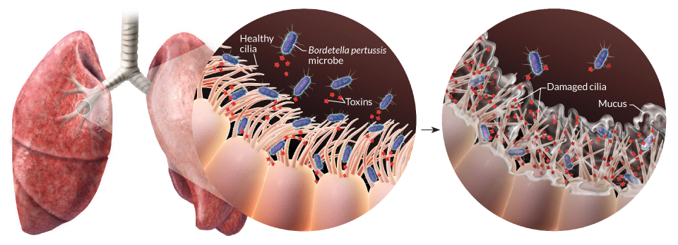
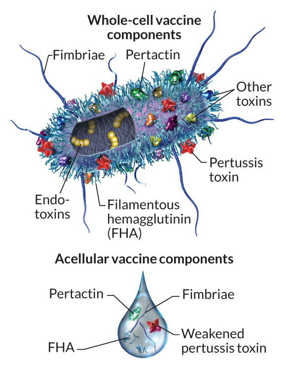
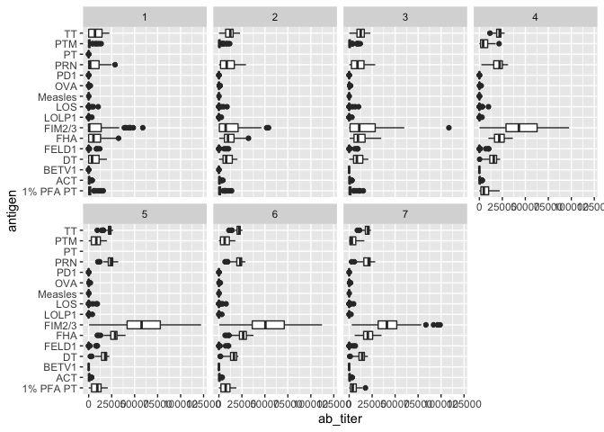
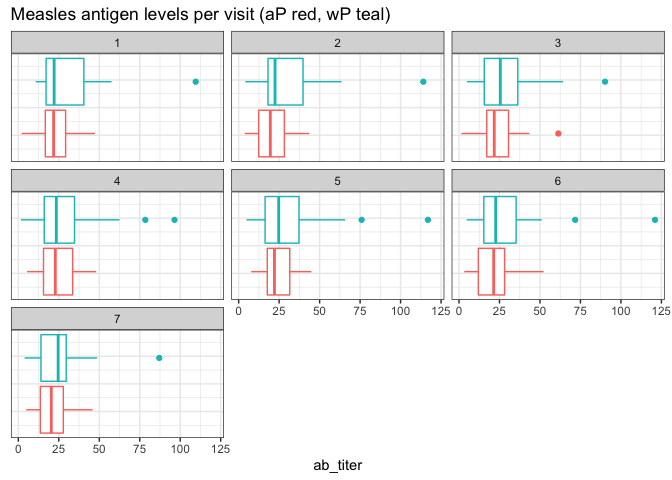
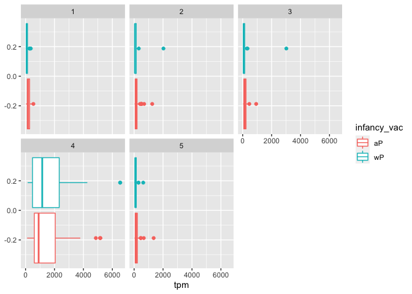

---
title: "Mini-Project"
subtitle: 'Investigating Pertussis Resurgence'
output: 
    labsheet::labsheet_default:
        keep_md: true
        theme: cosmo
        highlight: pygments
        toc: true
        toc_float: true
        toc_depth: 2
        number_sections: false
        code_folding: show
        df_print: paged
--- 

<!-- Standard knitr setup with labsheet package loading -->


<!-- Track Correct Student Responses -->
<div  class="scorecounter", id="total_correct"></div>


<!-- Author, course URL and time-stamp details -->
Barry Grant &lt; <http://thegrantlab.org/bggn213/> &gt;  
2022-03-07  (17:58:30 on Mon, Mar 07)  


# Background  

Pertussis (more commonly known as **whooping cough**) is a highly contagious respiratory disease caused by the bacterium *Bordetella pertussis*. People of all ages can be infected leading to violent coughing fits followed by a high-pitched intake of breath that sounds like "whoop". Infants and toddlers have the highest risk for severe complications and death. Recent estimates from the WHO suggest that ~16 million cases and 200,000 infant deaths are due to pertussis annually [1](https://pubmed.ncbi.nlm.nih.gov/20466419/).

> **Optional:** Link to a [video of a child with pertussis](https://www.youtube.com/watch?v=S3oZrMGDMMw) (Note that some viewers may find this upsetting).

{style="float: left;" width="500"}

*Bordetella pertussis* attacks cells lining the airways. The rope-like structures shown are cilia, that typically sweep away inhaled dirt and foreign objects. In a pertussis infection, the bacteria use adhesive proteins to stick whilst releasing toxins that damage cells, trigger inflammation and increase mucus production leading to uncontrollable violent coughing.


# 1. Investigating pertussis cases by year

The United States *Centers for Disease Control and Prevention* (CDC) has been compiling reported pertussis case numbers since 1922 in their *National Notifiable Diseases Surveillance System* (NNDSS). We can view this data on the CDC website here: https://www.cdc.gov/pertussis/surv-reporting/cases-by-year.html


<div class='q_box'>

- **Q1.**  With the help of the R "addin" package [**datapasta**](https://milesmcbain.github.io/datapasta/) assign the CDC pertussis case number data to a data frame called `cdc` and use **ggplot** to make a plot of cases numbers over time.


<div class='solution'><button>Hint</button>

To help "scrape" this data from the CDC website you can install the [**datapasta package**](https://milesmcbain.github.io/datapasta/), which will appear under the RStudio "**Addins**" menu button and allow you to web-scrape by copying tables of data from any website or PDF and then in RStudio selecting *"Paste as data.frame"* from the RStudio "**Addins**" menu. 


```r
ggplot(cdc) +
  aes(___, ___) +
  geom_point() +
  geom____() +
  labs(___)
```


<!-- -->


</div>


</div>


> **Key point:** Pertussis vaccination is, in general, highly effective at preventing the disease. In the pre-vaccine era (before 1946) pertussis was a much more common disease and a major cause of infant mortality [2](https://www.cdc.gov/vaccines/pubs/surv-manual/chpt10-pertussis.html). As we see clearly from analysis of the CDC tracking data above, introduction of the first pertussis vaccination in the United States in 1946 resulted in a dramatic reduction in the number of yearly cases from > 200,000 in the 1940s to < 2,000 in the 1970s. 

# 2. A tale of two vaccines (wP & aP)

{style="float: right;" width="300"}
Two types of pertussis vaccines have been developed: **whole-cell pertussis (wP)** and **acellular pertussis (aP)**. The first vaccines were composed of ‘whole cell’ (wP) inactivated bacteria. The latter aP vaccines use purified antigens of the bacteria (the most important pertussis components for our immune system). These aP vaccines were developed to have less side effects than the older wP vaccines and are now the only form administered in the United States.  


> *Side-note*: Currently in United States aP vaccines are administered to infants in combination with those for **d**iphtheria (D) and **t**etanus (T) in the so-called **DTaP vaccine** combination.  A distinct **Tdap** formulation, with reduced doses of diphtheria and pertussis, is administered as a boost for preteens, teens, and adults.

For motivated readers there is a nice historical account of the wP to aP vaccine switch in the US and elsewhere here:
https://www.ncbi.nlm.nih.gov/pmc/articles/PMC4975064/

Let's return to our CDC data plot and examine what happened after the switch to the acellular pertussis (aP) vaccination program.


<div class='q_box'>

- **Q2.** Using the ggplot `geom_vline()` function add lines to your previous plot for the 1946 introduction of the wP vaccine and the 1996 switch to aP vaccine (see example in the hint below). What do you notice?  


<div class='solution'><button>Hint</button>


Your plot should look something like the one below where we take our plot from Q1  and minimally add two `geom_vline(xintercept=___)` function calls. Here I also add optional text labels with `geom_text()` to help annotate the lines.

<!-- -->


</div>


- **Q3.** Describe what happened after the introduction of the aP vaccine? Do you have a possible explanation for the observed trend?


<div class='solution'><button>Hint</button>

It is clear from the CDC data that pertussis cases are once again increasing. For example, we can see that in 2012 the CDC reported 48,277 cases of pertussis in the United States. This is the largest number of cases reported since 1955, when 62,786 cases were reported. The pertussis field has several hypotheses for the resurgence of pertussis including (in no particular order): **1)** more sensitive PCR-based testing, **2)** vaccination hesitancy **3)** bacterial evolution (escape from vaccine immunity), **4)** waning of immunity in adolescents originally primed as infants with the newer aP vaccine as compared to the older wP vaccine.


</div>


</div>

 
> **Key-point:** Despite high levels of acellular pertussis (aP) vaccination, the United States and other countries are now experiencing a significant resurgence in pertussis cases with large outbreaks now once again a major public health concern.

<span style="color: green;">
**Additional points for discussion:** How are vaccines currently approved?
</span>

<span style="color: green;"><ul> 
<li> Typically we first examine *‘Correlates of protection’* which are things that can be measured within weeks or months after vaccination, and which are thought to correlate with increased protection from disease. For the aP vaccine this was  an induction of antibodies against pertussis toxin (PT) in infants at equivalent levels to those induced by the wP vaccine. The aP vaccines also had less side effects (reduction of sore arms, fever and pain).</li> 
<li> Testing for protection induced by a new vaccine requires a lot of people exposed to the pathogen (like in a pandemic).</li>
<li> It is impossible to discover a effect 10 years post vaccination in the current trial system.</li>
<li> It is unclear what differentiates people that have been primed with aP vs. wP long term.</li>
<li> CMI-PB project is an attempt to make data on this question open and examinable by all.</li>
</ul></span>

# 3. Exploring CMI-PB data

**Why is this vaccine-preventable disease on the upswing?** To answer this question we need to investigate the mechanisms underlying waning protection against pertussis. This requires evaluation of pertussis-specific immune responses over time in wP and aP vaccinated individuals. 

The new and ongoing [**CMI-PB project**](https://www.cmi-pb.org/) aims to provide the scientific community with this very information. In particular, CMI-PB tracks and makes freely available long-term humoral and cellular immune response data for a large number of individuals who received either DTwP or DTaP combination vaccines in infancy followed by Tdap booster vaccinations. This includes complete API access to longitudinal RNA-Seq, AB Titer, Olink, and live cell assay results directly from their website: https://www.cmi-pb.org/ 

> **Key-point**: For the CMI-PB project a booster shot is a proxy for what happens when you get infected.	


## The CMI-PB API returns JSON data

The CMI-PB API (like most APIs) sends responses in JSON format. Briefly, JSON data is formatted as a series of **key-value pairs**, where a particular word ("key") is associated with a particular value. An example of the JSON format for Ab titer data is shown below:

```
{
"specimen_id":1,
 "isotype":"IgG",
 "is_antigen_specific":true,
 "antigen":"PT",
 "ab_titer":68.5661390514946,
 "unit":"IU/ML",
 "lower_limit_of_detection":0.53
 } 

```


To read these types of files into R we will use the `read_json()` function from the **jsonlite** package. Note that if you want to do more advanced querys of APIs directly from R you will likely want to explore the more full featured  **rjson** package. The big advantage of using jsonlite for our current purposes is that it can simplify JSON key-value pair arrays into R data frames without much additional effort on our part.


```r
# Allows us to read, write and process JSON data
library(jsonlite)
```

Let's now read the main **subject** database table from the CMI-PB API. You can find out more about the content and format of this and other tables here: https://www.cmi-pb.org/blog/understand-data/


```r
subject <- read_json("https://www.cmi-pb.org/api/subject", simplifyVector = TRUE) 
```


> **Key-point:** The `subject` table provides metadata about each individual in the study group. For example, their infancy vaccination type, biological sex, year of birth, time of boost etc.


```r
head(subject, 3)
```

<div data-pagedtable="false">
  <script data-pagedtable-source type="application/json">
{"columns":[{"label":[""],"name":["_rn_"],"type":[""],"align":["left"]},{"label":["subject_id"],"name":[1],"type":["int"],"align":["right"]},{"label":["infancy_vac"],"name":[2],"type":["chr"],"align":["left"]},{"label":["biological_sex"],"name":[3],"type":["chr"],"align":["left"]},{"label":["ethnicity"],"name":[4],"type":["chr"],"align":["left"]},{"label":["race"],"name":[5],"type":["chr"],"align":["left"]},{"label":["year_of_birth"],"name":[6],"type":["chr"],"align":["left"]},{"label":["date_of_boost"],"name":[7],"type":["chr"],"align":["left"]},{"label":["study_name"],"name":[8],"type":["chr"],"align":["left"]}],"data":[{"1":"1","2":"wP","3":"Female","4":"Not Hispanic or Latino","5":"White","6":"1986-01-01","7":"2016-09-12","8":"2020_dataset","_rn_":"1"},{"1":"2","2":"wP","3":"Female","4":"Not Hispanic or Latino","5":"White","6":"1968-01-01","7":"2019-01-28","8":"2020_dataset","_rn_":"2"},{"1":"3","2":"wP","3":"Female","4":"Unknown","5":"White","6":"1983-01-01","7":"2016-10-10","8":"2020_dataset","_rn_":"3"}],"options":{"columns":{"min":{},"max":[10]},"rows":{"min":[10],"max":[10]},"pages":{}}}
  </script>
</div>


<div class='q_box'>

- **Q4.** How many aP and wP infancy vaccinated subjects are in the dataset?


<div class='solution'><button>Solution</button>


```r
table(subject$infancy_vac)
```

```
## 
## aP wP 
## 47 49
```

</div>


- **Q5.** How many Male and Female subjects/patients are in the dataset?


- **Q6.** What is the breakdown of race and biological sex (e.g. number of Asian females, White males etc...)?


<div class='solution'><button>Hint</button>


```r
table(subject$___, subject$___) )
```


|       | American Indian/Alaska Native| Asian| Black or African American| More Than One Race| Native Hawaiian or Other Pacific Islander| Unknown or Not Reported| White|
|:------|-----------------------------:|-----:|-------------------------:|------------------:|-----------------------------------------:|-----------------------:|-----:|
|Female |                             0|    18|                         2|                  8|                                         1|                      10|    27|
|Male   |                             1|     9|                         0|                  2|                                         1|                       4|    13|

</div>


</div>


## Side-Note:  Working with dates

Two of the columns of `subject` contain dates in the Year-Month-Day format. Recall from our last mini-project that dates and times can be annoying to work with at the best of times. However, in R we have the excellent lubridate package, which can make life allot easier. Here is a quick example to get you started:


```r
library(lubridate)
```

What is today’s date (at the time I am writing this obviously)

```r
today()
```

```
## [1] "2022-03-07"
```

How many days have passed since new year 2000 


```r
today() - ymd("2000-01-01")
```

```
## Time difference of 8101 days
```

What is this in years?


```r
time_length( today() - ymd("2000-01-01"),  "years")
```

```
## [1] 22.17933
```

Note that here we are using the `ymd()` function to tell lubridate the format of our particular date and then the `time_length()` function to convert days to years.


<div class='q_box'>

- **Q7.** Using this approach determine (i) the average age of wP individuals, (ii) the average age of aP individuals; and (iii) are they significantly different? 


<div class='solution'><button>Hint</button>


```r
# Use todays date to calculate age in days
subject$age <- today() - ___
```


```r
library(dplyr)

ap <- subject %>% filter(infancy_vac == "aP")

round( summary( time_length( ap$age, "years" ) ) )
```

```
##    Min. 1st Qu.  Median    Mean 3rd Qu.    Max. 
##      22      24      25      24      25      26
```


```r
# wP
wp <- subject %>% ___(___ == "wP")
round( summary( time_length( wp$age, "years" ) ) )
```


```
##    Min. 1st Qu.  Median    Mean 3rd Qu.    Max. 
##      27      31      34      35      39      54
```

</div>


- **Q8.** Determine the age of all individuals at time of boost?


<div class='solution'><button>Hint</button>


```r
int <- ymd(subject$date_of_boost) - ymd(subject$year_of_birth)
age_at_boost <- time_length(int, "year")
head(age_at_boost)
```

```
## [1] 30.69678 51.07461 33.77413 28.65982 25.65914 28.77481
```


</div>


- **Q9.** With the help of a faceted boxplot (see below), do you think these two groups are significantly different? 


```r
ggplot(subject) +
  aes(time_length(age, "year"),
      fill=as.factor(infancy_vac)) +
  geom_histogram(show.legend=FALSE) +
  facet_wrap(vars(infancy_vac), nrow=2) 
```

<!-- -->


<div class='solution'><button>Hint</button>

Sure are, it is not necessary but we could calculate a p-value...

```r
# Or use wilcox.test() 
x <- t.test(time_length( wp$age, "years" ),
       time_length( ap$age, "years" ))

x$p.value
```

```
## [1] 1.316045e-16
```

</div>


</div>


## Joining multiple tables

Read the specimen and ab_titer tables into R and store the data as `specimen` and `titer` named data frames.


```r
# Complete the API URLs...
specimen <- read_json("___/specimen", simplifyVector = TRUE) 
titer <- read_json("https://www.cmi-pb.org/api/___", simplifyVector = TRUE) 
```


To know whether a given `specimen_id` comes from an aP or wP individual we need to link (a.k.a. "join" or merge) our `specimen` and `subject` data frames. The excellent **dplyr** package (that we have used previously) has a family of `join()` functions that can help us with this common task: 


<div class='q_box'>

- **Q9.** Complete the code to join `specimen` and `subject` tables to make a new merged data frame containing all specimen records along with their associated subject details: 


```r
meta <- ____join(___, subject)
dim(meta)
head(meta)
```


```
## [1] 729  14
```


<div class='solution'><button>Hint</button>

To answer this question you need to chose the correct `join()` function (from `inner_join()`, `left_join()`, `right_join()` and `full_join()` options) as well as select the order of `x` and `y` input arguments.


For a nice description of other join types see: https://www.garrickadenbuie.com/project/tidyexplain/ from where the animated images above were taken.


</div>


- **Q10.** Now using the same procedure join `meta` with `titer` data so we can further analyze this data in terms of time of visit aP/wP, male/female etc.


```r
abdata <- inner_join(___, meta)
dim(abdata)
```


```
## Joining, by = "specimen_id"
```

```
## [1] 32675    20
```

- **Q11.** How many specimens (i.e. entries in `abdata`) do we have for each `isotype`? 


<div class='solution'><button>Hint</button>

We can use our old friend the `table()` function on the `isotype` column to answer this question: 


```r
table(abdata$isotype)
```

```
## 
##  IgE  IgG IgG1 IgG2 IgG3 IgG4 
## 6698 1413 6141 6141 6141 6141
```

</div>


- **Q12.** What do you notice about the number of visit 8 specimens compared to other visits?


<div class='solution'><button>Hint</button>

You can again use `table()` this time on the the `visit` column to help answer this question.


</div>


</div>


# 4. Examine IgG1 Ab titer levels

Now using our joined/merged/linked `abdata` dataset `filter()` for IgG1 `isotype` and exclude the small number of visit 8 entries.  


```r
ig1 <- abdata %>% filter(isotype == "IgG1", visit!=8)
head(ig1)
```

<div data-pagedtable="false">
  <script data-pagedtable-source type="application/json">
{"columns":[{"label":[""],"name":["_rn_"],"type":[""],"align":["left"]},{"label":["specimen_id"],"name":[1],"type":["int"],"align":["right"]},{"label":["isotype"],"name":[2],"type":["chr"],"align":["left"]},{"label":["is_antigen_specific"],"name":[3],"type":["lgl"],"align":["right"]},{"label":["antigen"],"name":[4],"type":["chr"],"align":["left"]},{"label":["ab_titer"],"name":[5],"type":["dbl"],"align":["right"]},{"label":["unit"],"name":[6],"type":["chr"],"align":["left"]},{"label":["lower_limit_of_detection"],"name":[7],"type":["dbl"],"align":["right"]},{"label":["subject_id"],"name":[8],"type":["int"],"align":["right"]},{"label":["actual_day_relative_to_boost"],"name":[9],"type":["int"],"align":["right"]},{"label":["planned_day_relative_to_boost"],"name":[10],"type":["int"],"align":["right"]},{"label":["specimen_type"],"name":[11],"type":["chr"],"align":["left"]},{"label":["visit"],"name":[12],"type":["int"],"align":["right"]},{"label":["infancy_vac"],"name":[13],"type":["chr"],"align":["left"]},{"label":["biological_sex"],"name":[14],"type":["chr"],"align":["left"]},{"label":["ethnicity"],"name":[15],"type":["chr"],"align":["left"]},{"label":["race"],"name":[16],"type":["chr"],"align":["left"]},{"label":["year_of_birth"],"name":[17],"type":["chr"],"align":["left"]},{"label":["date_of_boost"],"name":[18],"type":["chr"],"align":["left"]},{"label":["study_name"],"name":[19],"type":["chr"],"align":["left"]},{"label":["age"],"name":[20],"type":["drtn"],"align":["right"]}],"data":[{"1":"1","2":"IgG1","3":"TRUE","4":"ACT","5":"274.355068","6":"IU/ML","7":"3.848750","8":"1","9":"-3","10":"0","11":"Blood","12":"1","13":"wP","14":"Female","15":"Not Hispanic or Latino","16":"White","17":"1986-01-01","18":"2016-09-12","19":"2020_dataset","20":"13214 days","_rn_":"1"},{"1":"1","2":"IgG1","3":"TRUE","4":"LOS","5":"10.974026","6":"IU/ML","7":"4.357917","8":"1","9":"-3","10":"0","11":"Blood","12":"1","13":"wP","14":"Female","15":"Not Hispanic or Latino","16":"White","17":"1986-01-01","18":"2016-09-12","19":"2020_dataset","20":"13214 days","_rn_":"2"},{"1":"1","2":"IgG1","3":"TRUE","4":"FELD1","5":"1.448796","6":"IU/ML","7":"2.699944","8":"1","9":"-3","10":"0","11":"Blood","12":"1","13":"wP","14":"Female","15":"Not Hispanic or Latino","16":"White","17":"1986-01-01","18":"2016-09-12","19":"2020_dataset","20":"13214 days","_rn_":"3"},{"1":"1","2":"IgG1","3":"TRUE","4":"BETV1","5":"0.100000","6":"IU/ML","7":"1.734784","8":"1","9":"-3","10":"0","11":"Blood","12":"1","13":"wP","14":"Female","15":"Not Hispanic or Latino","16":"White","17":"1986-01-01","18":"2016-09-12","19":"2020_dataset","20":"13214 days","_rn_":"4"},{"1":"1","2":"IgG1","3":"TRUE","4":"LOLP1","5":"0.100000","6":"IU/ML","7":"2.550606","8":"1","9":"-3","10":"0","11":"Blood","12":"1","13":"wP","14":"Female","15":"Not Hispanic or Latino","16":"White","17":"1986-01-01","18":"2016-09-12","19":"2020_dataset","20":"13214 days","_rn_":"5"},{"1":"1","2":"IgG1","3":"TRUE","4":"Measles","5":"36.277417","6":"IU/ML","7":"4.438966","8":"1","9":"-3","10":"0","11":"Blood","12":"1","13":"wP","14":"Female","15":"Not Hispanic or Latino","16":"White","17":"1986-01-01","18":"2016-09-12","19":"2020_dataset","20":"13214 days","_rn_":"6"}],"options":{"columns":{"min":{},"max":[10]},"rows":{"min":[10],"max":[10]},"pages":{}}}
  </script>
</div>


<div class='q_box'>

- **Q13.** Complete the following code to make a summary boxplot of Ab titer levels for all antigens: 


```r
ggplot(ig1) +
  aes(___, antigen) +
  geom____() + 
  facet_wrap(vars(visit), nrow=2)
```


<!-- -->
   

- **Q14.** What antigens show differences in the level of IgG1 antibody titers recognizing them over time? Why these and not others? 


</div>


We can attempt to examine differences between wP and aP here by setting color and/or facet values of the plot to include `infancy_vac` status (see below). However these plots tend to be rather busy and thus hard to interpret easily. 


```r
ggplot(ig1) +
  aes(ab_titer, antigen, col=infancy_vac ) +
  geom_boxplot(show.legend = FALSE) + 
  facet_wrap(vars(visit), nrow=2) +
  theme_bw()
```

<!-- -->

Another version of this plot adding `infancy_vac` to the faceting:


```r
ggplot(ig1) +
  aes(ab_titer, antigen, col=infancy_vac ) +
  geom_boxplot(show.legend = FALSE) + 
  facet_wrap(vars(infancy_vac, visit), nrow=2)
```

<!-- -->


<div class='q_box'>

- **Q15.** Filter to pull out only two specific antigens for analysis and create a boxplot for each. You can chose any you like. Below I picked a "control" antigen (**"Measles"**, that is not in our vaccines) and a clear antigen of interest (**"FIM2/3"**, extra-cellular fimbriae proteins from *B. pertussis* that participate in substrate attachment). 


```r
filter(ig1, antigen=="Measles") %>%
  ggplot() +
  aes(ab_titer, col=infancy_vac) +
  geom_boxplot(show.legend = ___) +
  facet_wrap(vars(visit)) +
  theme_bw()
```


<!-- -->
and the same for `antigen=="FIM2/3"` 


```r
filter(ig1, antigen==___) %>%
  ggplot() +
  aes(ab_titer, col=infancy_vac) +
  geom_boxplot(show.legend = ___) +
  facet_wrap(vars(visit)) +
  theme_bw()
```

<!-- -->
  

- **Q16.** What do you notice about these two antigens time courses and the FIM2/3 data in particular?


<div class='solution'><button>Hint</button>

FIM2/3 levels clearly rise over time and far exceed those of Measles. They also appear to peak at visit 5 and then decline. This trend appears similar for for wP and aP subjects.

</div>


- **Q17.** Do you see any clear difference in aP vs. wP responses? 

</div>


# 5. Obtaining CMI-PB RNASeq data

For RNA-Seq data the API query mechanism quickly hits the web browser interface limit for file size. We will present alternative download mechanisms for larger CMI-PB datasets in the next section. However, we can still do "targeted" RNA-Seq querys via the web accessible API. 

For example we can obtain RNA-Seq results for a specific ENSEMBLE gene identifier or multiple identifiers combined with the & character:

```
# For example use the following URL
https://www.cmi-pb.org/api/v2/rnaseq?versioned_ensembl_gene_id=eq.ENSG00000211896.7
```

The link above is for the key gene involved in expressing any IgG1 antibody, namely the [IGHG1 gene](https://uswest.ensembl.org/Homo_sapiens/Gene/Summary?g=ENSG00000211896;r=14:105736343-105743071). Let's read available RNA-Seq data for this gene into R and investigate the time course of it's gene expression values. 


```r
url <- "https://www.cmi-pb.org/api/v2/rnaseq?versioned_ensembl_gene_id=eq.ENSG00000211896.7"

rna <- read_json(url, simplifyVector = TRUE) 
```

To facilitate further analysis we need to "join" the `rna` expression data with our metadata `meta`, which is itself a join of sample and specimen data. This will allow us to look at this genes TPM expression values over aP/wP status and at different visits (i.e. times):


```r
#meta <- inner_join(specimen, subject)
ssrna <- inner_join(rna, meta)
```

```
## Joining, by = "specimen_id"
```


<div class='q_box'>

- **Q18.** Make a plot of the time course of gene expression for IGHG1 gene (i.e. a plot of `visit` vs. `tpm`).


```r
ggplot(ssrna) +
  aes(visit, tpm, group=subject_id) +
  geom_point() +
  geom_line(alpha=0.2)
```

<!-- -->


- **Q19.**: What do you notice about the expression of this gene (i.e. when is it at it's maximum level)?

- **Q20.** Does this pattern in time match the trend of antibody titer data? If not, why not? 


<div class='solution'><button>Hint</button>

Cells make antibodies, which are long lived


</div>


</div>


We can dig deeper and color and/or facet by `infancy_vac` status:


```r
ggplot(ssrna) +
  aes(tpm, col=infancy_vac) +
  geom_boxplot() +
  facet_wrap(vars(visit))
```

<!-- -->

There is no obvious wP vs. aP differences here even if we focus in on a particular visit:


```r
ssrna %>%  
  filter(visit==4) %>% 
  ggplot() +
    aes(tpm, col=infancy_vac) + geom_density() + 
    geom_rug() 
```

<!-- -->
 


# 6. Working with larger datasets [OPTIONAL] 

As API based RNA-Seq querys can quickly become large requests, CMI-PB makes CSV files available for download. We will take their "2020 longitudinal RNA-Seq data" file (named `2020LD_rnaseq.csv`) from here:
https://www.cmi-pb.org/downloads/cmipb_challenge_datasets/2021_cmipb_challenge/

> **Note:** This file is over 321MB so the download may take some time over slow internet connections. 


```r
# Change for your downloaded file path
rnaseq <- read.csv("~/Downloads/2020LD_rnaseq.csv")

head(rnaseq,3)
```

<div data-pagedtable="false">
  <script data-pagedtable-source type="application/json">
{"columns":[{"label":[""],"name":["_rn_"],"type":[""],"align":["left"]},{"label":["versioned_ensembl_gene_id"],"name":[1],"type":["chr"],"align":["left"]},{"label":["specimen_id"],"name":[2],"type":["int"],"align":["right"]},{"label":["raw_count"],"name":[3],"type":["int"],"align":["right"]},{"label":["tpm"],"name":[4],"type":["dbl"],"align":["right"]}],"data":[{"1":"ENSG00000229704.1","2":"209","3":"0","4":"0","_rn_":"1"},{"1":"ENSG00000229707.1","2":"209","3":"0","4":"0","_rn_":"2"},{"1":"ENSG00000229708.1","2":"209","3":"0","4":"0","_rn_":"3"}],"options":{"columns":{"min":{},"max":[10]},"rows":{"min":[10],"max":[10]},"pages":{}}}
  </script>
</div>

This is rather large, look at the number of rows we have here:

```r
dim(rnaseq)
```

```
## [1] 10502460        4
```

## Working with long format data

Note that our `rnadata` is in so-called **"long" format** rather than the more conventional **"wide" format** tables of expression data that we have worked with in the past (where rows represent genes and different columns represent counts in different experiments with a column per experiment). Here we have genes in the rows but have we counts for all experiments collated together in one column. Along with this we have our now familiar `specimen_id` column to tell us which experiment the values come from.  

Lets have a look at how many genes we have reported for each `specimen_id` with our old friend the `table()` function.


```r
n_genes <- table(rnaseq$specimen_id)
head( n_genes , 10)
```

```
## 
##     1     3     4     5     6    19    20    21    22    23 
## 58347 58347 58347 58347 58347 58347 58347 58347 58347 58347
```

How many specimens?

```r
length(n_genes)
```

```
## [1] 180
```

Check if there are the same number of genes for each specimen

```r
all(n_genes[1]==n_genes)
```

```
## [1] TRUE
```

### Convert to "wide" format

All looks good at this stage so let's convert to wider format with the `pivot_wider()` function from the **tidyr** package:


```r
library(tidyr)

rna_wide <- rnaseq %>% 
  select(versioned_ensembl_gene_id, specimen_id, tpm) %>%
  pivot_wider(names_from = specimen_id, values_from=tpm)

dim(rna_wide)
```

```
## [1] 58347   181
```


```r
head(rna_wide[,1:7], 3)
```

<div data-pagedtable="false">
  <script data-pagedtable-source type="application/json">
{"columns":[{"label":["versioned_ensembl_gene_id"],"name":[1],"type":["chr"],"align":["left"]},{"label":["209"],"name":[2],"type":["dbl"],"align":["right"]},{"label":["74"],"name":[3],"type":["dbl"],"align":["right"]},{"label":["160"],"name":[4],"type":["dbl"],"align":["right"]},{"label":["81"],"name":[5],"type":["dbl"],"align":["right"]},{"label":["102"],"name":[6],"type":["dbl"],"align":["right"]},{"label":["163"],"name":[7],"type":["dbl"],"align":["right"]}],"data":[{"1":"ENSG00000229704.1","2":"0","3":"0","4":"0","5":"0","6":"0","7":"0"},{"1":"ENSG00000229707.1","2":"0","3":"0","4":"0","5":"0","6":"0","7":"0"},{"1":"ENSG00000229708.1","2":"0","3":"0","4":"0","5":"0","6":"0","7":"0"}],"options":{"columns":{"min":{},"max":[10]},"rows":{"min":[10],"max":[10]},"pages":{}}}
  </script>
</div>


## Filtering

As usual we have lots of zero count genes that can be removed (i.e. filtered out) before further analysis. Generally we will want to remove genes which are expressed at low levels or show only small changes in expression. 

# Key remaining questions

Once you have got this far we can begin to investigate the relationship between mRNA levels on different days (e.g. visit 1 vs. visit 4 etc.) and start to address the next set of pressing questions: 

> **Key-questions:** 
>
> - Is RNA-Seq expression levels predictive of Ab titers?
> - What differentiates aP vs. wP primed individuals? 
> - What about decades after their first immunization? Do you know? Contact Bjoern and Barry for your trip to Sweden :-)

 
These are all ares of active research. What is clear is that there are immune responses not captured in antibody titers. We are trying to capture the ‘systems level’ response to antigen encounters (here: vaccination). Something must be different in aP vs. wP primed individuals. That is why CMI-PB make all their data available for the wider community to explore and contribute new analysis methods. We invite you to join us in addressing these important open questions!


# About this document

Here we use the `sessionInfo()` function to report on our R systems setup at the time of document execution. 


```r
sessionInfo()
```

```
## R version 4.1.2 (2021-11-01)
## Platform: x86_64-apple-darwin17.0 (64-bit)
## Running under: macOS Big Sur 10.16
## 
## Matrix products: default
## BLAS:   /Library/Frameworks/R.framework/Versions/4.1/Resources/lib/libRblas.0.dylib
## LAPACK: /Library/Frameworks/R.framework/Versions/4.1/Resources/lib/libRlapack.dylib
## 
## locale:
## [1] en_US.UTF-8/en_US.UTF-8/en_US.UTF-8/C/en_US.UTF-8/en_US.UTF-8
## 
## attached base packages:
## [1] stats     graphics  grDevices utils     datasets  methods   base     
## 
## other attached packages:
##  [1] lubridate_1.8.0 jsonlite_1.8.0  forcats_0.5.1   stringr_1.4.0  
##  [5] dplyr_1.0.8     purrr_0.3.4     readr_2.1.2     tidyr_1.2.0    
##  [9] tibble_3.1.6    ggplot2_3.3.5   tidyverse_1.3.1 labsheet_0.1.2 
## 
## loaded via a namespace (and not attached):
##  [1] tidyselect_1.1.2 xfun_0.29        bslib_0.3.1      haven_2.4.3     
##  [5] colorspace_2.0-3 vctrs_0.3.8      generics_0.1.2   htmltools_0.5.2 
##  [9] yaml_2.3.5       utf8_1.2.2       rlang_1.0.1      jquerylib_0.1.4 
## [13] pillar_1.7.0     withr_2.4.3      glue_1.6.1       DBI_1.1.2       
## [17] dbplyr_2.1.1     readxl_1.3.1     modelr_0.1.8     lifecycle_1.0.1 
## [21] cellranger_1.1.0 munsell_0.5.0    gtable_0.3.0     rvest_1.0.2     
## [25] evaluate_0.15    labeling_0.4.2   knitr_1.37       tzdb_0.2.0      
## [29] fastmap_1.1.0    fansi_1.0.2      highr_0.9        Rcpp_1.0.8      
## [33] broom_0.7.12     backports_1.4.1  scales_1.1.1     farver_2.1.0    
## [37] fs_1.5.2         hms_1.1.1        digest_0.6.29    stringi_1.7.6   
## [41] grid_4.1.2       cli_3.2.0        tools_4.1.2      magrittr_2.0.2  
## [45] sass_0.4.0       crayon_1.5.0     pkgconfig_2.0.3  ellipsis_0.3.2  
## [49] xml2_1.3.3       reprex_2.0.1     assertthat_0.2.1 rmarkdown_2.11  
## [53] httr_1.4.2       rstudioapi_0.13  R6_2.5.1         compiler_4.1.2
```

