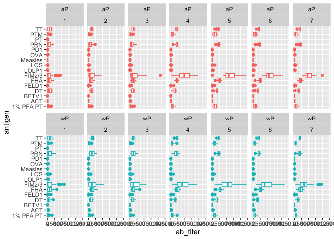

<!-- Standard knitr setup with labsheet package loading -->


<!-- Track Correct Student Responses -->
<div  class="scorecounter", id="total_correct"></div>


<!-- Author, course URL and time-stamp details -->
Barry Grant &lt; <http://thegrantlab.org/bggn213/> &gt;  
2022-03-06  (10:01:35 on Sun, Mar 06)  


# Background  

{style="float: right;" width="300"}
Pertussis (more commonly known as **whooping cough**) is reemerging worldwide despite effective vaccination programs. This highly contagious respiratory disease is caused by the bacterium *Bordetella pertussis*. People of all ages can be infected leading to violent coughing fits, vomiting and apnea (with characteristic strained breathing associated "whooping" sounds). However, pertussis is most severe and life threatening for infants. Indeed, recent estimates from the WHO suggest that approximately 16 million cases and 200,000 infant deaths are due to pertussis annually [1](https://pubmed.ncbi.nlm.nih.gov/20466419/).

Pertussis vaccination is, in general, highly effective at preventing the disease. In the pre-vaccine era pertussis was a much more common disease and a major cause of infant mortality [2](https://www.cdc.gov/vaccines/pubs/surv-manual/chpt10-pertussis.html). As we will see from analysis of CDC data below, introduction of pertussis vaccination in the United States resulted in a dramatic reduction in the number of yearly cases from > 200,000 in the 1940s to < 2,000 in 1970s. **Unfortunately, in recent years we have seen a significant resurgence in pertussis cases with large outbreaks now once again a major public health concern.** 

> **Key-question:** Why is this vaccine-preventable disease on the upswing?

## A tale of two vaccines

Two types of pertussis vaccines are currently available: **whole-cell pertussis (wP)** and **acellular pertussis (aP)**. The latter aP vaccines use purified antigens of the bacteria and were developed to have less side effects than the older wP vaccines. Currently in United States aP vaccines are administered to infants in combination with those for **d**iphtheria (D) and **t**etanus (T) in the so-called **DTaP vaccine** combo.  A distinct **Tdap** formulation, with reduced doses of diphtheria and pertussis, is administered as a boost for preteens, teens, and adults.

> **Key-point:** Despite high levels of acellular pertussis (aP) vaccination, the United States and other countries are now experiencing increasing pertussis case numbers. To investigating this further let's examine the history of CDC reported case numbers along with the time points for wP and aP vaccine introduction. 


# Investigating pertussis cases by year

The CDC has been compiling reported pertussis case numbers since 1922 in their *National Notifiable Diseases Surveillance System* (NNDSS). We can view this data on the CDC website here: https://www.cdc.gov/pertussis/surv-reporting/cases-by-year.html


<div class='q_box'>

- **Q1.**  With the help of the R "addin" package [**datapasta**](https://milesmcbain.github.io/datapasta/) assign the CDC pertussis case number data to a data frame called `cdc` and use **ggplot** or base R to make the following plot.


<div class='solution'><button>Hint</button>

To help "scrape" this data from the CDC website you can install the [**datapasta package**](https://milesmcbain.github.io/datapasta/), which will appear under the RStudio "**Addins**" menu button and allow you to web-scrape by copying tables of data from any website or PDF and then in RStudio selecting *"Paste as data.frame"* from the RStudio "**Addins**" menu. 


```r
ggplot(cdc) +
  aes(___, ___) +
  geom_point() +
  geom____() +
  labs(___)
```


</div>


<!-- -->

- **Q2.** Using the `geom_vline()` function add a line for the 1946 introduction of the wP vaccine and the 1996 switch to aP vaccine (see example below). 


<!-- -->

- **Q3.** Why do you think there may be a lag from the time of aP introduction to the increasing case numbers in the early 2000s?


<div class='solution'><button>Hint</button>

It is clear from the CDC data that pertussis cases are once again increasing. For example, we can see that in 2012 the CDC reported 48,277 cases of pertussis in the United States. This is the largest number of cases reported since 1955, when 62,786 cases were reported. One of the main hypotheses to explain this resurgence is the **waning of immunity** in adolescents originally primed as infants with the newer aP vaccine as compared to the older wP vaccine.

*Side-note:* There is a nice historical account of the wP to aP vaccine switch in the US and elsewhere here:
https://www.ncbi.nlm.nih.gov/pmc/articles/PMC4975064/

</div>


</div>

 


> **Key-point:** Understanding the mechanisms underlying waning protection against pertussis requires evaluation of pertussis-specific immune responses over time in wP and aP vaccinated individuals. 

# Exploring CMI-PB community resource

The new and ongoing [**CMI-PB project**](https://www.cmi-pb.org/) aims to provide the scientific community with this very information. In particular, CMI-PB tracks and makes freely available long-term humoral and cellular immune response data for a large number of individuals who received either DTwP or DTaP combination vaccines in infancy followed by Tdap booster vaccinations. This includes complete API access to longitudinal RNA-Seq, AB Titer, Olink, and live cell assay results directly from their website: https://www.cmi-pb.org/ 


## The CMI-PB API returns JSON foramt data

The CMI-PB API (like most APIs) sends responses in JSON format. Briefly, JSON data is formatted as a series of **key-value pairs**, where a particular word ("key") is associated with a particular value. An example of the JSON format for Ab titer data is shown below:

```
{
"specimen_id":1,
 "isotype":"IgG",
 "is_antigen_specific":true,
 "antigen":"PT",
 "ab_titer":68.5661390514946,
 "unit":"IU/ML",
 "lower_limit_of_detection":0.53
 } 

```


To read these types of files into R we will use the `read_json()` function from the **jsonlite** package. Note that if you want to do more advanced querys of APIs directly from R you will likely want to explore the more full featured  **rjson** package. The big advantage of using jsonlite for our current purposes is that it can simplify JSON key-value pair arrays into R data frames without much additional effort on our part.


```r
# Allows us to read, write and process JSON data
library(jsonlite)
```

Let's now read the main **subject** database table from the CMI-PB API. You can find out more about the content and format of this and other tables here: https://www.cmi-pb.org/blog/understand-data/


```r
subject <- read_json("https://www.cmi-pb.org/api/subject", simplifyVector = TRUE) 
```


Basically, the `subject` table provides metadata about each individual in the study group. For example, their infancy vaccination type, biological sex, year of birth etc.


```r
head(subject, 3)
```

<div data-pagedtable="false">
  <script data-pagedtable-source type="application/json">
{"columns":[{"label":[""],"name":["_rn_"],"type":[""],"align":["left"]},{"label":["subject_id"],"name":[1],"type":["int"],"align":["right"]},{"label":["infancy_vac"],"name":[2],"type":["chr"],"align":["left"]},{"label":["biological_sex"],"name":[3],"type":["chr"],"align":["left"]},{"label":["ethnicity"],"name":[4],"type":["chr"],"align":["left"]},{"label":["race"],"name":[5],"type":["chr"],"align":["left"]},{"label":["year_of_birth"],"name":[6],"type":["chr"],"align":["left"]},{"label":["date_of_boost"],"name":[7],"type":["chr"],"align":["left"]},{"label":["study_name"],"name":[8],"type":["chr"],"align":["left"]}],"data":[{"1":"1","2":"wP","3":"Female","4":"Not Hispanic or Latino","5":"White","6":"1986-01-01","7":"2016-09-12","8":"2020_dataset","_rn_":"1"},{"1":"2","2":"wP","3":"Female","4":"Not Hispanic or Latino","5":"White","6":"1968-01-01","7":"2019-01-28","8":"2020_dataset","_rn_":"2"},{"1":"3","2":"wP","3":"Female","4":"Unknown","5":"White","6":"1983-01-01","7":"2016-10-10","8":"2020_dataset","_rn_":"3"}],"options":{"columns":{"min":{},"max":[10]},"rows":{"min":[10],"max":[10]},"pages":{}}}
  </script>
</div>


<div class='q_box'>

- **Q4.** How may aP and wP infancy vaccinated samples are in the dataset?


<div class='solution'><button>Solution</button>


```r
table(subject$infancy_vac)
```

```
## 
## aP wP 
## 47 49
```

</div>


- **Q5.** How many Male and Female subjects/patients are in the dataset?


- **Q6.** What is the breakdown of race and biological sex (e.g. number of Asian females, White males etc...)?


<div class='solution'><button>Hint</button>


```r
table(subject$___, subject$___) )
```


|       | American Indian/Alaska Native| Asian| Black or African American| More Than One Race| Native Hawaiian or Other Pacific Islander| Unknown or Not Reported| White|
|:------|-----------------------------:|-----:|-------------------------:|------------------:|-----------------------------------------:|-----------------------:|-----:|
|Female |                             0|    18|                         2|                  8|                                         1|                      10|    27|
|Male   |                             1|     9|                         0|                  2|                                         1|                       4|    13|

</div>


</div>


## Side-Note:  Working with dates

Two of the columns of `subject` contain dates in the Year-Month-Day format. Recall from our last mini-project that dates and times can be annoying to work with at the best of times. However, in R we have the excellent lubridate package, which can make life allot easier. Here is a quick example to get you started:


```r
library(lubridate)
```

What is today’s date (at the time I am writing this obviously)

```r
today()
```

```
## [1] "2022-03-06"
```

How many days have passed since new year 2000 


```r
today() - ymd("2000-01-01")
```

```
## Time difference of 8100 days
```

What is this in years?


```r
time_length( today() - ymd("2000-01-01"),  "years")
```

```
## [1] 22.17659
```

Note that here we are using the `ymd()` function to tell lubridate the format of our particular date and then the `time_length()` function to convert days to years.


<div class='q_box'>

- **Q7.** Using this approach determine (i) the average age of wP individuals, (ii) the average age of aP individuals; and (iii) are they significantly different? 


<div class='solution'><button>Hint</button>


```r
# Use todays date to calculate age in days
subject$age <- today() - ___
```


```r
library(dplyr)

ap <- subject %>% filter(infancy_vac == "aP")

round( summary( time_length( ap$age, "years" ) ) )
```

```
##    Min. 1st Qu.  Median    Mean 3rd Qu.    Max. 
##      22      24      25      24      25      26
```


```r
# wP
wp <- subject %>% ___(___ == "wP")
round( summary( time_length( wp$age, "years" ) ) )
```


```
##    Min. 1st Qu.  Median    Mean 3rd Qu.    Max. 
##      27      31      34      35      39      54
```

</div>


- **Q8.** Determine the age of all individuals at time of boost?


<div class='solution'><button>Hint</button>


```r
int <- ymd(subject$date_of_boost) - ymd(subject$year_of_birth)
age_at_boost <- time_length(int, "year")
head(age_at_boost)
```

```
## [1] 30.69678 51.07461 33.77413 28.65982 25.65914 28.77481
```


</div>


- **Q9.** With the help of a faceted boxplot (see below), do you think these two groups are significantly different? 


```r
ggplot(subject) +
  aes(time_length(age, "year"),
      fill=as.factor(infancy_vac)) +
  geom_histogram(show.legend=FALSE) +
  facet_wrap(vars(infancy_vac), nrow=2) 
```

<!-- -->


<div class='solution'><button>Hint</button>

Sure are, it is not necessary but we could calculate a p-value...

```r
# Or use wilcox.test() 
x <- t.test(time_length( wp$age, "years" ),
       time_length( ap$age, "years" ))

x$p.value
```

```
## [1] 1.316045e-16
```

</div>


</div>


# Joining multiple tables

Read the specimen and ab_titer tables into R and store the data as `specimen` and `titer` named data frames.


```r
specimen <- read_json("___/specimen", simplifyVector = TRUE) 
titer <- read_json("https://www.cmi-pb.org/api/___", simplifyVector = TRUE) 
```


To know whether a given `specimen_id` comes from an aP or wP individual we need to merge (a.k.a. "join") 
our `specimen` and `subject` data frames. The excellent **dplyr** package (that we have used previously) has a family of `join()` functions that can help us with this common task: 


<div class='q_box'>

- **Q9.** Complete the code to join `specimen` and `subject` tables to make a new merged data frame containing all specimen records along with their associated subject details: 


```r
meta <- ____join(___, subject)
dim(meta)
head(meta)
```


```
## [1] 729  14
```

- **Q10.** Now using the same procedure join `meta` with `titer` data so we can further analyze this data in terms of time of visit aP/wP, male/female etc.


```r
abdata <- inner_join(___, meta)
dim(abdata)
```


```
## Joining, by = "specimen_id"
```

```
## [1] 32675    20
```


```r
table(abdata$isotype)
```

```
## 
##  IgE  IgG IgG1 IgG2 IgG3 IgG4 
## 6698 1413 6141 6141 6141 6141
```

</div>


## Examine IgG1 Ab titer leves - TO IMPROVE WITH BJOERN

Now using our fully merged `abdata` dataset `filter()` for IgG1 `isotype` and make a crazy ass boxplot of ab_titer levels for all antigens: 


```r
ig1 <- abdata %>% filter(isotype == "IgG1")
head(ig1)
```

<div data-pagedtable="false">
  <script data-pagedtable-source type="application/json">
{"columns":[{"label":[""],"name":["_rn_"],"type":[""],"align":["left"]},{"label":["specimen_id"],"name":[1],"type":["int"],"align":["right"]},{"label":["isotype"],"name":[2],"type":["chr"],"align":["left"]},{"label":["is_antigen_specific"],"name":[3],"type":["lgl"],"align":["right"]},{"label":["antigen"],"name":[4],"type":["chr"],"align":["left"]},{"label":["ab_titer"],"name":[5],"type":["dbl"],"align":["right"]},{"label":["unit"],"name":[6],"type":["chr"],"align":["left"]},{"label":["lower_limit_of_detection"],"name":[7],"type":["dbl"],"align":["right"]},{"label":["subject_id"],"name":[8],"type":["int"],"align":["right"]},{"label":["actual_day_relative_to_boost"],"name":[9],"type":["int"],"align":["right"]},{"label":["planned_day_relative_to_boost"],"name":[10],"type":["int"],"align":["right"]},{"label":["specimen_type"],"name":[11],"type":["chr"],"align":["left"]},{"label":["visit"],"name":[12],"type":["int"],"align":["right"]},{"label":["infancy_vac"],"name":[13],"type":["chr"],"align":["left"]},{"label":["biological_sex"],"name":[14],"type":["chr"],"align":["left"]},{"label":["ethnicity"],"name":[15],"type":["chr"],"align":["left"]},{"label":["race"],"name":[16],"type":["chr"],"align":["left"]},{"label":["year_of_birth"],"name":[17],"type":["chr"],"align":["left"]},{"label":["date_of_boost"],"name":[18],"type":["chr"],"align":["left"]},{"label":["study_name"],"name":[19],"type":["chr"],"align":["left"]},{"label":["age"],"name":[20],"type":["drtn"],"align":["right"]}],"data":[{"1":"1","2":"IgG1","3":"TRUE","4":"ACT","5":"274.355068","6":"IU/ML","7":"3.848750","8":"1","9":"-3","10":"0","11":"Blood","12":"1","13":"wP","14":"Female","15":"Not Hispanic or Latino","16":"White","17":"1986-01-01","18":"2016-09-12","19":"2020_dataset","20":"13213 days","_rn_":"1"},{"1":"1","2":"IgG1","3":"TRUE","4":"LOS","5":"10.974026","6":"IU/ML","7":"4.357917","8":"1","9":"-3","10":"0","11":"Blood","12":"1","13":"wP","14":"Female","15":"Not Hispanic or Latino","16":"White","17":"1986-01-01","18":"2016-09-12","19":"2020_dataset","20":"13213 days","_rn_":"2"},{"1":"1","2":"IgG1","3":"TRUE","4":"FELD1","5":"1.448796","6":"IU/ML","7":"2.699944","8":"1","9":"-3","10":"0","11":"Blood","12":"1","13":"wP","14":"Female","15":"Not Hispanic or Latino","16":"White","17":"1986-01-01","18":"2016-09-12","19":"2020_dataset","20":"13213 days","_rn_":"3"},{"1":"1","2":"IgG1","3":"TRUE","4":"BETV1","5":"0.100000","6":"IU/ML","7":"1.734784","8":"1","9":"-3","10":"0","11":"Blood","12":"1","13":"wP","14":"Female","15":"Not Hispanic or Latino","16":"White","17":"1986-01-01","18":"2016-09-12","19":"2020_dataset","20":"13213 days","_rn_":"4"},{"1":"1","2":"IgG1","3":"TRUE","4":"LOLP1","5":"0.100000","6":"IU/ML","7":"2.550606","8":"1","9":"-3","10":"0","11":"Blood","12":"1","13":"wP","14":"Female","15":"Not Hispanic or Latino","16":"White","17":"1986-01-01","18":"2016-09-12","19":"2020_dataset","20":"13213 days","_rn_":"5"},{"1":"1","2":"IgG1","3":"TRUE","4":"Measles","5":"36.277417","6":"IU/ML","7":"4.438966","8":"1","9":"-3","10":"0","11":"Blood","12":"1","13":"wP","14":"Female","15":"Not Hispanic or Latino","16":"White","17":"1986-01-01","18":"2016-09-12","19":"2020_dataset","20":"13213 days","_rn_":"6"}],"options":{"columns":{"min":{},"max":[10]},"rows":{"min":[10],"max":[10]},"pages":{}}}
  </script>
</div>

```r
ggplot(ig1) +
  aes(ab_titer, antigen, col=infancy_vac ) +
  geom_boxplot(show.legend = FALSE) + 
  facet_wrap(vars(ig1$visit))
```

<!-- -->

We should exclude visit 8 as there are not may data points...


```r
table(ig1$visit)
```

```
## 
##    1    2    3    4    5    6    7    8 
## 1101  870  870  870  870  810  735   15
```


```r
tmp <- filter(ig1, visit!=8)
table(tmp$visit)
```

```
## 
##    1    2    3    4    5    6    7 
## 1101  870  870  870  870  810  735
```


```r
ggplot(tmp) +
  aes(ab_titer, antigen, col=infancy_vac ) +
  geom_boxplot(show.legend = FALSE) + 
  facet_wrap(vars(visit), nrow=2) +
  theme_bw()
```

<!-- -->


```r
ggplot(tmp) +
  aes(ab_titer, antigen, col=infancy_vac ) +
  geom_boxplot(show.legend = FALSE) + 
  facet_wrap(vars(infancy_vac, visit), nrow=2)
```

<!-- -->

Plot of Measles IgG1


```r
filter(tmp, antigen=="Measles") %>%
  ggplot() +
  aes(ab_titer, col=infancy_vac) +
  geom_boxplot() +
  facet_wrap(vars(visit))
```

<!-- -->

```r
filter(tmp, antigen=="FIM2/3") %>%
  ggplot() +
  aes(ab_titer, col=infancy_vac) +
  geom_boxplot(show.legend = FALSE) +
  facet_wrap(vars(visit)) +
  labs(title="FIM2/3 levels per visit (aP red, wP teal)") +
  theme_bw() +
  theme(axis.text.y=element_blank(),
        axis.ticks.y=element_blank()) 
```

<!-- -->


# Working with CMI-PB RNASeq data

For RNA-Seq data the API query mechanism quickly hits the web browser interface limit for file size.
We can still do targeted RNA-Seq querys, For example we can obtain RNA-Seq results for a specific ENSEMBLE gene id. Multiple IDs can be combined with the & character:

```
# Use the following URL
https://www.cmi-pb.org/api/v2/rnaseq?versioned_ensembl_gene_id=eq.ENSG00000211896.7
```


```r
url <- "https://www.cmi-pb.org/api/v2/rnaseq?versioned_ensembl_gene_id=eq.ENSG00000211896.7"

rna <- read_json(url, simplifyVector = TRUE) 
```

However as even these querys can quickly become large requests CMI-PB makes CSV files available for download from: https://www.cmi-pb.org/downloads/cmipb_challenge_datasets/2021_cmipb_challenge/

Here we will download the `2020LD_rnaseq.csv` file, which is over 321MB so the download may take some time over slow internet connections. 

Whilst downloading let's join our single gene `rna` data with our `meta` object that is itself a join of subject and specimen tables. This will allow us to look at this genes TPM expression values over aP/wP and at different visits:


```r
#meta <- inner_join(specimen, subject)
ssrna <- inner_join(rna, meta)
```

```
## Joining, by = "specimen_id"
```

```r
ggplot(ssrna) +
  aes(tpm, col=infancy_vac) +
  geom_boxplot() +
  facet_wrap(vars(visit))
```

<!-- -->

Let's focus in on visit 4


```r
ssrna %>%  
  filter(visit==4) %>% #%>% select(visit) #%>% head()
  ggplot() +
    aes(tpm, col=infancy_vac) + geom_density() + 
    geom_rug() 
```

<!-- -->
> Q. Facet by biological sex `+ facet_wrap(vars(biological_sex))` any obvious difference?


### Read from CSV downloads file

Due to the API file size limitation CMI-PB make a large CSV format file with all RNA-Seq count and TPM data available for download. We will take their "2020 longitudinal RNA-Seq data" file (named `2020LD_rnaseq.csv`) from here:
https://www.cmi-pb.org/downloads/cmipb_challenge_datasets/2021_cmipb_challenge/


```r
rnaseq <- read.csv("~/Downloads/2020LD_rnaseq.csv")

head(rnaseq,3)
```

<div data-pagedtable="false">
  <script data-pagedtable-source type="application/json">
{"columns":[{"label":[""],"name":["_rn_"],"type":[""],"align":["left"]},{"label":["versioned_ensembl_gene_id"],"name":[1],"type":["chr"],"align":["left"]},{"label":["specimen_id"],"name":[2],"type":["int"],"align":["right"]},{"label":["raw_count"],"name":[3],"type":["int"],"align":["right"]},{"label":["tpm"],"name":[4],"type":["dbl"],"align":["right"]}],"data":[{"1":"ENSG00000229704.1","2":"209","3":"0","4":"0","_rn_":"1"},{"1":"ENSG00000229707.1","2":"209","3":"0","4":"0","_rn_":"2"},{"1":"ENSG00000229708.1","2":"209","3":"0","4":"0","_rn_":"3"}],"options":{"columns":{"min":{},"max":[10]},"rows":{"min":[10],"max":[10]},"pages":{}}}
  </script>
</div>

This is rather large, look at the number of rows we have here:

```r
dim(rnaseq)
```

```
## [1] 10502460        4
```

Also note that this data is in so-called **"long" format** rather than the more conventional **"wide" format** tables of expression data that we have worked with in the past (where rows represent genes and different columns represent counts in different experiments with a column per experiment). Here we have genes in the rows but have we counts for all experiments collated together in one column. Along with this we have our now familiar `specimen_id` column to tell us which experiment the values come from.  

Lets have a look at how many genes we have reported for each `specimen_id` with our old friend the `table()` function.


```r
n_genes <- table(rnaseq$specimen_id)
head( n_genes , 10)
```

```
## 
##     1     3     4     5     6    19    20    21    22    23 
## 58347 58347 58347 58347 58347 58347 58347 58347 58347 58347
```

How many specimens?

```r
length(n_genes)
```

```
## [1] 180
```
Check if there are the same number of genes for each specimen

```r
all(n_genes[1]==n_genes)
```

```
## [1] TRUE
```

## Convert to "wide" format

All looks good at this stage. Let's convert to wider format with the `pivot_wider()` function:


```r
library(tidyr)

rna_wide <- rnaseq %>% 
  #select(versioned_ensembl_gene_id, specimen_id, raw_count) %>%
  #pivot_wider(names_from = specimen_id, values_from=raw_count) 
  select(versioned_ensembl_gene_id, specimen_id, tpm) %>%
  pivot_wider(names_from = specimen_id, values_from=tpm)

dim(rna_wide)
```

```
## [1] 58347   181
```


```r
head(rna_wide[,1:7], 3)
```

<div data-pagedtable="false">
  <script data-pagedtable-source type="application/json">
{"columns":[{"label":["versioned_ensembl_gene_id"],"name":[1],"type":["chr"],"align":["left"]},{"label":["209"],"name":[2],"type":["dbl"],"align":["right"]},{"label":["74"],"name":[3],"type":["dbl"],"align":["right"]},{"label":["160"],"name":[4],"type":["dbl"],"align":["right"]},{"label":["81"],"name":[5],"type":["dbl"],"align":["right"]},{"label":["102"],"name":[6],"type":["dbl"],"align":["right"]},{"label":["163"],"name":[7],"type":["dbl"],"align":["right"]}],"data":[{"1":"ENSG00000229704.1","2":"0","3":"0","4":"0","5":"0","6":"0","7":"0"},{"1":"ENSG00000229707.1","2":"0","3":"0","4":"0","5":"0","6":"0","7":"0"},{"1":"ENSG00000229708.1","2":"0","3":"0","4":"0","5":"0","6":"0","7":"0"}],"options":{"columns":{"min":{},"max":[10]},"rows":{"min":[10],"max":[10]},"pages":{}}}
  </script>
</div>

As usual we have lots of zero count genes that should be removed (i.e. filtered out) before most further analysis.

## Filtering

As we have done in previous analyses we can implement a filtering step to remove genes which are expressed at low levels or show only small changes in expression. A popular procedure is the setting of a minimum threshold for variation.


```r
sum.counts <- rowSums(rna_wide[,-1])
sd.counts <- apply(rna_wide[,-1],1,sd)

#plot(sd.counts)
rna <- rna_wide[sum.counts > 5, ]
#plot( sort(), ylim=c(0,100) )
```


```r
nrow(rna_wide)
```

```
## [1] 58347
```

```r
nrow(rna)
```

```
## [1] 33937
```

We maybe need to compare visit 1 to visit 4 for some aP and wP folks and call pathways or something?


### PCA does not show shit


```r
pca <- prcomp(t(rna[,-1]), scale=TRUE)
summary(pca)
```

```
## Importance of components:
##                            PC1      PC2      PC3     PC4      PC5      PC6
## Standard deviation     67.5248 54.66475 39.56105 34.5632 31.76637 26.19876
## Proportion of Variance  0.1343  0.08805  0.04612  0.0352  0.02973  0.02022
## Cumulative Proportion   0.1343  0.22241  0.26852  0.3037  0.33346  0.35368
##                            PC7      PC8      PC9     PC10     PC11     PC12
## Standard deviation     24.0884 22.19145 20.85307 20.50797 20.13617 18.85522
## Proportion of Variance  0.0171  0.01451  0.01281  0.01239  0.01195  0.01048
## Cumulative Proportion   0.3708  0.38529  0.39811  0.41050  0.42245  0.43292
##                            PC13    PC14     PC15     PC16     PC17     PC18
## Standard deviation     18.68639 17.8580 17.09888 16.76520 16.30607 16.21069
## Proportion of Variance  0.01029  0.0094  0.00862  0.00828  0.00783  0.00774
## Cumulative Proportion   0.44321  0.4526  0.46122  0.46951  0.47734  0.48508
##                            PC19     PC20     PC21     PC22     PC23     PC24
## Standard deviation     15.70069 15.57897 15.09006 15.02918 14.99305 14.63961
## Proportion of Variance  0.00726  0.00715  0.00671  0.00666  0.00662  0.00632
## Cumulative Proportion   0.49235  0.49950  0.50621  0.51287  0.51949  0.52580
##                            PC25     PC26     PC27     PC28     PC29     PC30
## Standard deviation     14.54826 14.33022 14.08408 13.97326 13.87045 13.80028
## Proportion of Variance  0.00624  0.00605  0.00584  0.00575  0.00567  0.00561
## Cumulative Proportion   0.53204  0.53809  0.54394  0.54969  0.55536  0.56097
##                            PC31     PC32     PC33     PC34     PC35     PC36
## Standard deviation     13.67189 13.48895 13.38990 13.38060 13.21942 13.13290
## Proportion of Variance  0.00551  0.00536  0.00528  0.00528  0.00515  0.00508
## Cumulative Proportion   0.56648  0.57184  0.57712  0.58240  0.58755  0.59263
##                            PC37     PC38     PC39     PC40     PC41     PC42
## Standard deviation     12.96568 12.91849 12.77882 12.69187 12.55019 12.47884
## Proportion of Variance  0.00495  0.00492  0.00481  0.00475  0.00464  0.00459
## Cumulative Proportion   0.59758  0.60250  0.60731  0.61206  0.61670  0.62129
##                            PC43     PC44     PC45     PC46     PC47     PC48
## Standard deviation     12.46376 12.30986 12.19798 12.04818 11.94873 11.84975
## Proportion of Variance  0.00458  0.00447  0.00438  0.00428  0.00421  0.00414
## Cumulative Proportion   0.62587  0.63033  0.63472  0.63899  0.64320  0.64734
##                            PC49     PC50    PC51     PC52     PC53     PC54
## Standard deviation     11.75695 11.69310 11.5115 11.48194 11.42333 11.30404
## Proportion of Variance  0.00407  0.00403  0.0039  0.00388  0.00385  0.00377
## Cumulative Proportion   0.65141  0.65544  0.6593  0.66323  0.66708  0.67084
##                            PC55     PC56     PC57     PC58     PC59     PC60
## Standard deviation     11.23745 11.17641 11.13246 11.06184 11.01103 10.96913
## Proportion of Variance  0.00372  0.00368  0.00365  0.00361  0.00357  0.00355
## Cumulative Proportion   0.67456  0.67824  0.68189  0.68550  0.68907  0.69262
##                           PC61     PC62     PC63     PC64     PC65     PC66
## Standard deviation     10.9055 10.86077 10.80156 10.78617 10.73049 10.68224
## Proportion of Variance  0.0035  0.00348  0.00344  0.00343  0.00339  0.00336
## Cumulative Proportion   0.6961  0.69960  0.70304  0.70646  0.70986  0.71322
##                            PC67     PC68     PC69     PC70     PC71     PC72
## Standard deviation     10.64442 10.62930 10.54608 10.52759 10.50534 10.48040
## Proportion of Variance  0.00334  0.00333  0.00328  0.00327  0.00325  0.00324
## Cumulative Proportion   0.71656  0.71989  0.72316  0.72643  0.72968  0.73292
##                           PC73     PC74     PC75     PC76     PC77    PC78
## Standard deviation     10.4256 10.39370 10.36435 10.32936 10.32312 10.2623
## Proportion of Variance  0.0032  0.00318  0.00317  0.00314  0.00314  0.0031
## Cumulative Proportion   0.7361  0.73930  0.74247  0.74561  0.74875  0.7519
##                            PC79     PC80     PC81     PC82     PC83     PC84
## Standard deviation     10.21373 10.19043 10.17581 10.15535 10.14189 10.10417
## Proportion of Variance  0.00307  0.00306  0.00305  0.00304  0.00303  0.00301
## Cumulative Proportion   0.75493  0.75799  0.76104  0.76408  0.76711  0.77012
##                            PC85     PC86     PC87     PC88     PC89    PC90
## Standard deviation     10.06969 10.03327 10.02673 10.01664 10.00644 9.99307
## Proportion of Variance  0.00299  0.00297  0.00296  0.00296  0.00295 0.00294
## Cumulative Proportion   0.77311  0.77607  0.77904  0.78199  0.78494 0.78789
##                           PC91   PC92    PC93    PC94    PC95    PC96    PC97
## Standard deviation     9.95354 9.9156 9.90738 9.87559 9.86898 9.83586 9.79900
## Proportion of Variance 0.00292 0.0029 0.00289 0.00287 0.00287 0.00285 0.00283
## Cumulative Proportion  0.79081 0.7937 0.79660 0.79947 0.80234 0.80519 0.80802
##                           PC98    PC99  PC100   PC101   PC102   PC103   PC104
## Standard deviation     9.78256 9.77436 9.7415 9.72531 9.69050 9.66669 9.64089
## Proportion of Variance 0.00282 0.00282 0.0028 0.00279 0.00277 0.00275 0.00274
## Cumulative Proportion  0.81084 0.81365 0.8165 0.81924 0.82200 0.82476 0.82750
##                          PC105   PC106   PC107   PC108   PC109   PC110   PC111
## Standard deviation     9.63121 9.59924 9.58400 9.53771 9.52743 9.51316 9.50271
## Proportion of Variance 0.00273 0.00272 0.00271 0.00268 0.00267 0.00267 0.00266
## Cumulative Proportion  0.83023 0.83295 0.83565 0.83833 0.84101 0.84367 0.84633
##                          PC112   PC113   PC114   PC115  PC116   PC117   PC118
## Standard deviation     9.47529 9.44573 9.44335 9.41004 9.3932 9.37104 9.33555
## Proportion of Variance 0.00265 0.00263 0.00263 0.00261 0.0026 0.00259 0.00257
## Cumulative Proportion  0.84898 0.85161 0.85424 0.85685 0.8595 0.86203 0.86460
##                          PC119   PC120   PC121   PC122   PC123   PC124  PC125
## Standard deviation     9.31314 9.29864 9.27149 9.25896 9.24798 9.22596 9.2061
## Proportion of Variance 0.00256 0.00255 0.00253 0.00253 0.00252 0.00251 0.0025
## Cumulative Proportion  0.86716 0.86971 0.87224 0.87476 0.87728 0.87979 0.8823
##                          PC126   PC127   PC128   PC129   PC130   PC131   PC132
## Standard deviation     9.17924 9.17129 9.13891 9.10391 9.08562 9.06046 9.04712
## Proportion of Variance 0.00248 0.00248 0.00246 0.00244 0.00243 0.00242 0.00241
## Cumulative Proportion  0.88477 0.88725 0.88971 0.89215 0.89459 0.89701 0.89942
##                         PC133  PC134   PC135   PC136   PC137   PC138   PC139
## Standard deviation     9.0313 9.0238 9.00156 8.99272 8.97240 8.92981 8.92074
## Proportion of Variance 0.0024 0.0024 0.00239 0.00238 0.00237 0.00235 0.00234
## Cumulative Proportion  0.9018 0.9042 0.90661 0.90899 0.91136 0.91371 0.91606
##                          PC140   PC141   PC142  PC143  PC144   PC145   PC146
## Standard deviation     8.88697 8.87972 8.86015 8.8404 8.8296 8.80652 8.78667
## Proportion of Variance 0.00233 0.00232 0.00231 0.0023 0.0023 0.00229 0.00227
## Cumulative Proportion  0.91838 0.92071 0.92302 0.9253 0.9276 0.92991 0.93218
##                          PC147   PC148   PC149   PC150   PC151  PC152   PC153
## Standard deviation     8.76442 8.74436 8.71628 8.68520 8.67159 8.6446 8.61249
## Proportion of Variance 0.00226 0.00225 0.00224 0.00222 0.00222 0.0022 0.00219
## Cumulative Proportion  0.93445 0.93670 0.93894 0.94116 0.94338 0.9456 0.94776
##                          PC154   PC155   PC156   PC157   PC158   PC159   PC160
## Standard deviation     8.60980 8.58224 8.55794 8.53475 8.50605 8.49463 8.46881
## Proportion of Variance 0.00218 0.00217 0.00216 0.00215 0.00213 0.00213 0.00211
## Cumulative Proportion  0.94995 0.95212 0.95428 0.95642 0.95855 0.96068 0.96279
##                          PC161   PC162   PC163   PC164   PC165   PC166   PC167
## Standard deviation     8.45961 8.42618 8.41358 8.40390 8.38067 8.33413 8.32527
## Proportion of Variance 0.00211 0.00209 0.00209 0.00208 0.00207 0.00205 0.00204
## Cumulative Proportion  0.96490 0.96699 0.96908 0.97116 0.97323 0.97528 0.97732
##                          PC168   PC169  PC170   PC171   PC172   PC173   PC174
## Standard deviation     8.30937 8.25240 8.2381 8.22115 8.14752 8.08235 8.04306
## Proportion of Variance 0.00203 0.00201 0.0020 0.00199 0.00196 0.00192 0.00191
## Cumulative Proportion  0.97935 0.98136 0.9834 0.98535 0.98731 0.98923 0.99114
##                          PC175   PC176   PC177   PC178   PC179     PC180
## Standard deviation     7.96000 7.89385 7.75146 7.62979 7.53046 8.343e-14
## Proportion of Variance 0.00187 0.00184 0.00177 0.00172 0.00167 0.000e+00
## Cumulative Proportion  0.99301 0.99484 0.99661 0.99833 1.00000 1.000e+00
```


Metadata is in `meta` object. we can pull that to annotate our RNA seq dataset.

```r
ref_specimine_ids <- colnames(rna_wide[,-1])

y <- data.frame(specimen_id=as.numeric(ref_specimine_ids))
z <- inner_join(y, meta)
```

```
## Joining, by = "specimen_id"
```

```r
head(z)
```

<div data-pagedtable="false">
  <script data-pagedtable-source type="application/json">
{"columns":[{"label":[""],"name":["_rn_"],"type":[""],"align":["left"]},{"label":["specimen_id"],"name":[1],"type":["dbl"],"align":["right"]},{"label":["subject_id"],"name":[2],"type":["int"],"align":["right"]},{"label":["actual_day_relative_to_boost"],"name":[3],"type":["int"],"align":["right"]},{"label":["planned_day_relative_to_boost"],"name":[4],"type":["int"],"align":["right"]},{"label":["specimen_type"],"name":[5],"type":["chr"],"align":["left"]},{"label":["visit"],"name":[6],"type":["int"],"align":["right"]},{"label":["infancy_vac"],"name":[7],"type":["chr"],"align":["left"]},{"label":["biological_sex"],"name":[8],"type":["chr"],"align":["left"]},{"label":["ethnicity"],"name":[9],"type":["chr"],"align":["left"]},{"label":["race"],"name":[10],"type":["chr"],"align":["left"]},{"label":["year_of_birth"],"name":[11],"type":["chr"],"align":["left"]},{"label":["date_of_boost"],"name":[12],"type":["chr"],"align":["left"]},{"label":["study_name"],"name":[13],"type":["chr"],"align":["left"]},{"label":["age"],"name":[14],"type":["drtn"],"align":["right"]}],"data":[{"1":"209","2":"27","3":"1","4":"1","5":"Blood","6":"2","7":"aP","8":"Female","9":"Not Hispanic or Latino","10":"Asian","11":"1997-01-01","12":"2016-09-26","13":"2020_dataset","14":"9195 days","_rn_":"1"},{"1":"74","2":"9","3":"14","4":"14","5":"Blood","6":"5","7":"aP","8":"Male","9":"Not Hispanic or Latino","10":"Asian","11":"1996-01-01","12":"2016-07-25","13":"2020_dataset","14":"9561 days","_rn_":"2"},{"1":"160","2":"21","3":"0","4":"0","5":"Blood","6":"1","7":"wP","8":"Male","9":"Not Hispanic or Latino","10":"White","11":"1983-01-01","12":"2016-08-29","13":"2020_dataset","14":"14309 days","_rn_":"3"},{"1":"81","2":"10","3":"7","4":"7","5":"Blood","6":"4","7":"wP","8":"Female","9":"Not Hispanic or Latino","10":"Asian","11":"1982-01-01","12":"2016-07-25","13":"2020_dataset","14":"14674 days","_rn_":"4"},{"1":"102","2":"13","3":"0","4":"0","5":"Blood","6":"1","7":"aP","8":"Male","9":"Not Hispanic or Latino","10":"White","11":"1997-01-01","12":"2016-07-25","13":"2020_dataset","14":"9195 days","_rn_":"5"},{"1":"163","2":"21","3":"8","4":"7","5":"Blood","6":"4","7":"wP","8":"Male","9":"Not Hispanic or Latino","10":"White","11":"1983-01-01","12":"2016-08-29","13":"2020_dataset","14":"14309 days","_rn_":"6"}],"options":{"columns":{"min":{},"max":[10]},"rows":{"min":[10],"max":[10]},"pages":{}}}
  </script>
</div>


```r
# Color by wP/aP
plot(pca$x[,1:2], col=as.factor(z$infancy_vac))
```

<!-- -->

```r
# Color by visit number
plot(pca$x[,1:2], col=as.factor(z$visit))
```

<!-- -->


> QX. Investigate the relationship between Ab titers and mRNA levels on different days. Is RNA-Seq expresion levels predictive of Ab titers?


---


# Some guiding questions

Look at isotype IgG 

Look at different antigen's time course

Parse the subject data from the cmi-pb database. This is in JSON format.

> Q. How many infancy_vac are aP and wP ?

Add specimen count to subject table ()

> Q. How many subjects have a specimen count on day all days?  

> Q. Is there variability in igG Ab levels with time?

> Q. Do we see a difference between ap and wP?

> Q. Something with RNA-Seq levels

> Q. Investigate the relationship between Ab titers and mRNA levels on different days. Is RNA-Seq expresion levels predictive of Ab titers?


## Translate identifiers:


```r
library(AnnotationDbi)
library(org.Hs.eg.db)

#columns(org.Hs.eg.db)
mapIds(org.Hs.eg.db,
        keys="ENSG00000211896",
        keytype="ENSEMBL",
        column="SYMBOL")
```

```
## ENSG00000211896 
##         "IGHG1"
```

```r
mapIds(org.Hs.eg.db,
        keys="ENSG00000211896",
        keytype="ENSEMBL",
        column="GENENAME")
```

```
##                                      ENSG00000211896 
## "immunoglobulin heavy constant gamma 1 (G1m marker)"
```

# About this document

Here we use the `sessionInfo()` function to report on our R systems setup at the time of document execution. 


```r
sessionInfo()
```

```
## R version 4.1.2 (2021-11-01)
## Platform: x86_64-apple-darwin17.0 (64-bit)
## Running under: macOS Big Sur 10.16
## 
## Matrix products: default
## BLAS:   /Library/Frameworks/R.framework/Versions/4.1/Resources/lib/libRblas.0.dylib
## LAPACK: /Library/Frameworks/R.framework/Versions/4.1/Resources/lib/libRlapack.dylib
## 
## locale:
## [1] en_US.UTF-8/en_US.UTF-8/en_US.UTF-8/C/en_US.UTF-8/en_US.UTF-8
## 
## attached base packages:
## [1] stats4    stats     graphics  grDevices utils     datasets  methods  
## [8] base     
## 
## other attached packages:
##  [1] org.Hs.eg.db_3.14.0  AnnotationDbi_1.56.2 IRanges_2.28.0      
##  [4] S4Vectors_0.32.3     Biobase_2.54.0       BiocGenerics_0.40.0 
##  [7] lubridate_1.8.0      jsonlite_1.8.0       forcats_0.5.1       
## [10] stringr_1.4.0        dplyr_1.0.8          purrr_0.3.4         
## [13] readr_2.1.2          tidyr_1.2.0          tibble_3.1.6        
## [16] ggplot2_3.3.5        tidyverse_1.3.1      labsheet_0.1.2      
## 
## loaded via a namespace (and not attached):
##  [1] bitops_1.0-7           fs_1.5.2               bit64_4.0.5           
##  [4] httr_1.4.2             GenomeInfoDb_1.30.1    tools_4.1.2           
##  [7] backports_1.4.1        bslib_0.3.1            utf8_1.2.2            
## [10] R6_2.5.1               DBI_1.1.2              colorspace_2.0-3      
## [13] withr_2.4.3            tidyselect_1.1.2       bit_4.0.4             
## [16] compiler_4.1.2         cli_3.2.0              rvest_1.0.2           
## [19] xml2_1.3.3             labeling_0.4.2         sass_0.4.0            
## [22] scales_1.1.1           digest_0.6.29          rmarkdown_2.11        
## [25] XVector_0.34.0         pkgconfig_2.0.3        htmltools_0.5.2       
## [28] dbplyr_2.1.1           fastmap_1.1.0          highr_0.9             
## [31] rlang_1.0.1            readxl_1.3.1           rstudioapi_0.13       
## [34] RSQLite_2.2.10         jquerylib_0.1.4        farver_2.1.0          
## [37] generics_0.1.2         RCurl_1.98-1.6         magrittr_2.0.2        
## [40] GenomeInfoDbData_1.2.7 Rcpp_1.0.8             munsell_0.5.0         
## [43] fansi_1.0.2            lifecycle_1.0.1        stringi_1.7.6         
## [46] yaml_2.3.5             zlibbioc_1.40.0        grid_4.1.2            
## [49] blob_1.2.2             crayon_1.5.0           Biostrings_2.62.0     
## [52] haven_2.4.3            hms_1.1.1              KEGGREST_1.34.0       
## [55] knitr_1.37             pillar_1.7.0           reprex_2.0.1          
## [58] glue_1.6.1             evaluate_0.15          modelr_0.1.8          
## [61] vctrs_0.3.8            png_0.1-7              tzdb_0.2.0            
## [64] cellranger_1.1.0       gtable_0.3.0           assertthat_0.2.1      
## [67] cachem_1.0.6           xfun_0.29              broom_0.7.12          
## [70] memoise_2.0.1          ellipsis_0.3.2
```

